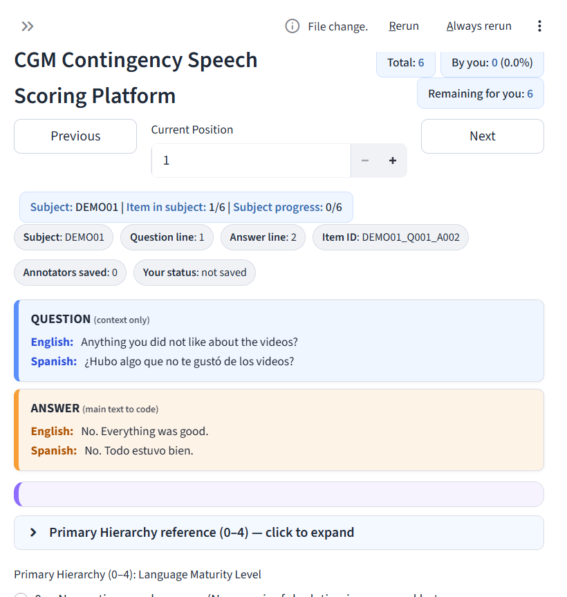

# CGM Contingency Speech Scoring Platform

[](LICENSE)
[](https://github.com/ag027592/cgm-contingency-scoring/actions/workflows/smoke.yml)
[](https://www.python.org/)
[](https://streamlit.io/)
[](https://cgm-contingency-scoring.streamlit.app/)
[](CITATION.cff)

Human-in-the-loop **annotation platform** for scoring how people talk about
learning from continuous glucose monitoring (CGM) feedback — specifically the
*contingency* structure of post-visit interview answers
(context → behavior → consequence → rule).

Built for multi-rater clinical coding with training gates, hidden attention
checks, and agreement analytics. This public repository ships **software +
synthetic demo data only** — no real transcripts, CGM streams, videos, or
study accounts.

## Why this exists (hiring-relevant)

Reliable labels for health dialogue are not a spreadsheet problem. This repo
shows an end-to-end **annotation product**:

- a bilingual coding UI (English / Spanish) with a hierarchical codebook
- onboarding (**Test Drive**) before Annotate unlocks
- embedded gold / attention items to catch careless coding
- admin **Agreement Dashboard** (exact agreement, Cohen’s κ, quadratic weighted κ)
- optional CGM context panel so language coding stays primary, sensor data secondary
- local auth suitable for lab deployment without a cloud IdP

If you review this for an Applied Scientist / Research Engineer role, start
with [`ARCHITECTURE.md`](ARCHITECTURE.md), then run the demo below.

## What coders label

| Primary (0–4) | Meaning (short) |
|---|---|
| 0 | No contingency (evaluation / non-answer) |
| 1 | Outcome without a clear cause |
| 2 | Behavior/context linked to glucose outcome |
| 3 | Enacted or intended behavior change |
| 4 | Explicit self-generated future rule |

Optional **Components**: Context, Behavior, Consequence, Rule.  
When a rule is present: **Rule Source** and **Behavior Form**.

Diagrams used in coder training live under
[`labeling_platform/docs/manual_images/`](labeling_platform/docs/manual_images/).

## Feature overview

| Feature | Description |
|---|---|
| Bilingual Q/A cards | EN/ES line items with keyword highlighting |
| Primary Hierarchy 0–4 | From no-contingency answers to self-generated future rules |
| Components + rule taxonomy | Context, behavior, consequence, rule source, behavior form |
| Test Drive gate | Onboarding check before Annotate unlocks |
| Attention checks | Hidden unambiguous items to flag careless coding |
| CGM context panel | Optional demographics / phase metrics beside the language task |
| Agreement dashboard | Pairwise agreement and gold accuracy for admins |
| Session auth | bcrypt passwords + signed cookie for local lab use |

## Quick start

**[Open the public Streamlit demo](https://cgm-contingency-scoring.streamlit.app/)** —
synthetic data only, with session-isolated annotations.

```bash
# from repository root
python -m venv .venv
# Windows: .venv\Scripts\activate
# Unix:    source .venv/bin/activate
pip install -r requirements.txt
streamlit run labeling_platform/app.py
```

Or from `labeling_platform/`:

```bash
pip install -r requirements.txt
streamlit run app.py
```

**Demo login** (synthetic accounts only — change immediately if you redeploy):

| Username | Password | Role |
|---|---|---|
| `demo` | `demo1234` | coder |
| `admin` | `admin1234` | admin |

Because the public bundle contains only `DEMO*` subjects, it automatically
uses **session-only public demo mode**: registration is disabled and saves
never modify repository files. See [`SECURITY.md`](SECURITY.md) for deployment
controls.

Suggested walkthrough: sign in as `demo` → open **Step 4 · Score Answers** →
label a few DEMO Q/A items → sign in as `admin` → open the **Agreement** view
(admin-only metrics appear after multiple coders save labels).

### Annotate UI (synthetic demo)



Bilingual Question / Answer cards, subject progress, Primary Hierarchy 0–4, and
component marking — all on synthetic `DEMO01` text.

## Repository layout

```
cgm-contingency-scoring/
├── labeling_platform/     # Streamlit app, coder manual, diagrams, scripts
├── labeling_assets/       # codebook + synthetic demo Q/A + empty annotations
├── glucose_data/          # synthetic DEMO demographics / CGM stubs
├── ARCHITECTURE.md        # scoring model + QC stack
├── CITATION.cff
└── LICENSE
```

Runtime paths resolve from the app’s `BASE_DIR` (parent of `labeling_platform/`),
so `labeling_assets/` and `glucose_data/` must sit beside it.

## Quality checks

```bash
pip install bcrypt pandas
python labeling_platform/scripts/smoke_check.py
```

CI runs the same smoke test on every push / PR (schema, demo logins, no real
`G2###` subject IDs in assets).

## Privacy and IRB

**Do not commit real participant data into this repository.**

Excluded from this release on purpose:

- G1/G2 post-visit transcripts (English / Spanish)
- Raw and computed CGM files from the study
- Interview videos / audio
- Real annotator accounts and session secrets
- Screenshots that may display participant text

To run on IRB-approved data, replace the synthetic files under
`labeling_assets/` and `glucose_data/` with de-identified exports that match the
same schemas, and keep those files **outside** public git history.

## Related materials (not in this repo)

Internal GCM project folders also contain LIWC analyses, proposal drafts, and
HITL planning docs. Those remain private until the study team decides what can
be shared under the IRB and data-use agreements.

## Citation

```bibtex
@misc{chou2026cgmscoring,
  title        = {CGM Contingency Speech Scoring Platform},
  author       = {Chou, Huang-Cheng},
  year         = {2026},
  howpublished = {GitHub repository},
  note         = {Open-source annotation software with synthetic demo data},
  url          = {https://github.com/ag027592/cgm-contingency-scoring}
}
```

## License

MIT for the software and documentation in this repository.
Synthetic demo utterances are fictional examples for software demonstration.
