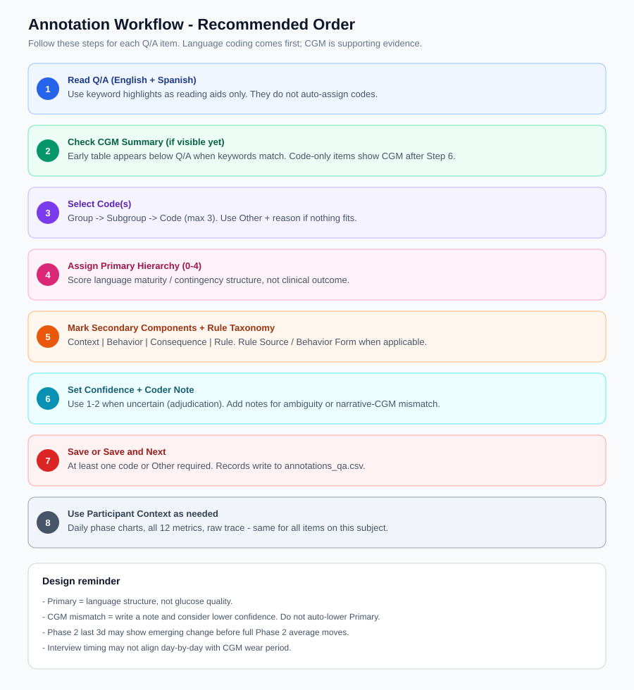
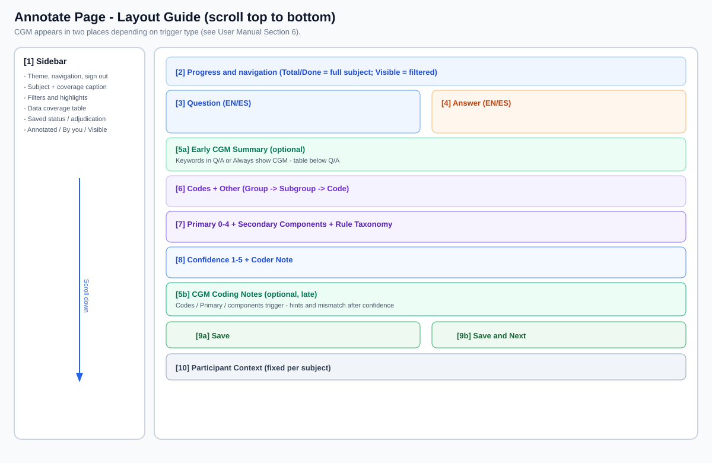

# CGM Contingency Scoring — User Manual

**Audience:** Coders, clinicians / reviewers / PIs, and adjudication reviewers  
**Interface language:** American English (this manual matches the UI)  
**Public demo snapshot:** synthetic subjects `DEMO01`–`DEMO03` only (software demonstration)  
**Full-study layout (IRB data, not public):** same app + codebook against private G1/G2 exports

> This manual describes the **product** as deployed for multi-rater clinical coding.
> Counts such as “29 subjects / 58 check samples” refer to a full private deployment.
> The public GitHub release ships a smaller synthetic set so reviewers can run the UI
> without PHI.

---

## Table of Contents

1. [What This Platform Does](#1-what-this-platform-does)
2. [Core Design Philosophy](#2-core-design-philosophy)
3. [G2 Study and Phase Design](#3-g2-study-and-phase-design)
4. [Getting Started: Sign In, Training, Navigation](#4-getting-started-sign-in-training-navigation)
5. [Visual Guide (Screenshots & Diagrams)](#visual-guide-screenshots--diagrams)
6. [Annotate Page — Full Workflow](#5-annotate-page--full-workflow)
7. [CGM Summary for Coding](#6-cgm-summary-for-coding)
8. [Participant Context](#7-participant-context)
9. [12 CGM Metrics Glossary](#8-12-cgm-metrics-glossary)
10. [Coding Confidence and Adjudication](#9-coding-confidence-and-adjudication)
11. [My Stats and Record Integrity](#10-my-stats-and-record-integrity)
12. [Guidance for Clinicians and PIs](#11-guidance-for-clinicians-and-pis)
13. [FAQ](#12-faq)
14. [Appendix: Save Format and File Locations](#13-appendix-save-format-and-file-locations)
15. [Platform Pages Reference](#14-platform-pages-reference)
16. [Coder Training Page](#15-coder-training-page)
17. [Theme, Display, and UI Conventions](#16-theme-display-and-ui-conventions)
18. [Keyword Highlighting](#17-keyword-highlighting)
19. [CGM Metric Presets and Pickers](#18-cgm-metric-presets-and-pickers)
20. [Feature Checklist (All Platform Functions)](#19-feature-checklist-all-platform-functions)
21. [Deployment and Maintenance](#20-deployment-and-maintenance)

---

## Visual Guide (Screenshots & Diagrams)

> **In the app:** Sidebar → **User Manual** → **Visual Guide** tab shows all figures below.

### Workflow diagram



**Steps 1–8:** Read Q/A → check CGM Summary (if shown) → select codes → assign Primary → mark components / rule taxonomy → set confidence + note → save → use Participant Context charts as needed.

### Page layout diagram



| Region | What you see |
|--------|----------------|
| [1] Sidebar | Theme, page nav, subject, filters, CGM toggle, data coverage, saved status, adjudication queue |
| [2] Navigation | Previous / Next, progress stats, status pills |
| [3]-[4] Q/A | Bilingual question and answer with optional keyword highlights |
| [5a] Early CGM Summary | Below Q/A when keywords match or Always show is on |
| [6] Codes | Up to 3 codes (Group -> Subgroup -> Code) or Other |
| [7] Primary | Primary 0-4, secondary components, rule taxonomy |
| [8] Confidence | Confidence 1-5 list, coder note |
| [5b] CGM Coding Notes | After confidence when codes/Primary/components trigger (hints, mismatch) |
| [9a]-[9b] Save | Save or Save and Next (green card) |
| [10] Participant Context | Demographics + CGM tabs (fixed per subject) |

### Interface screenshots

| Figure | Description |
|--------|-------------|
| **Figure 0** | Full Annotate page overview |
| **Figure A** | Navigation, Q/A cards, keyword legend (early CGM may peek below on relevant items) |
| **Figure B** | CGM Summary table (Phase 1 vs Phase 2, last 3d) |
| **Figure C** | Code selection slots (Group -> Subgroup -> Code; CGM table may appear above) |
| **Figure D** | Primary Hierarchy, secondary components, rule taxonomy |
| **Figure E** | Coding Confidence, coder note, late CGM notes, Save buttons |
| **Figure F** | Participant Context header, demographics card, CGM tab bar |
| **Figure G** | Alert Phase Comparison daily chart and delta bars |

UI diagrams (SVG) ship with this release. PNG screenshots of live study sessions are intentionally omitted to avoid exposing participant text; regenerate locally with `python scripts/capture_manual_screenshots.py` on your own deployment.

---

## 1. What This Platform Does

This platform supports structured coding of **post-interview Q/A** from G2 study participants using the **G2 Study Codebook 3.0**, supplemented by **CGM (continuous glucose monitoring)** and **demographics** data. The goal is to help coders determine whether participant language reflects:

- Understanding of CGM feedback (Device Understanding)
- Awareness and change in diet, exercise, and related behaviors (Learning Outcome)
- Contingency language linking alerts (>140 mg/dL) to behavior (Primary Hierarchy 0–4)

**Each annotation unit = one Q/A pair** (one interviewer question + one participant answer), not an entire transcript at once.

---

## 2. Core Design Philosophy

### 2.1 Language First, CGM as Support

| Principle | Explanation |
|-----------|-------------|
| **Primary Hierarchy evaluates language structure** | Assess whether the participant expresses contingency relationships (context → behavior → outcome → rule), not whether glucose values are good or bad |
| **CGM is supporting / conflicting evidence** | Compare what they *say* changed vs. Phase 2 glucose patterns. **Do not** automatically lower Primary because CGM worsened |
| **Interviews are retrospective** | Participants recall events after the fact; timelines may not align day-by-day with CGM. Use CGM for **overall patterns**, not sentence-level date matching |

### 2.2 Layout: Coding on Top, Reference Below

```
+-----------------------------------------+
|  Navigation, Q/A, coding form, Save      |  <- scrolls with each Q/A item
+-----------------------------------------+
|  [5a] Early CGM Summary (if keywords)    |  <- optional, below Q/A
+-----------------------------------------+
|  Codes, Primary, Confidence              |
+-----------------------------------------+
|  [5b] CGM Coding Notes (if code-triggered)|  <- optional, after confidence
+-----------------------------------------+
|  Participant Context (fixed per subject) |
+-----------------------------------------+
```

**Why?** Coders focus on the current Q/A. Subject-level CGM charts would distract if they scrolled away with every item.

### 2.3 One Subject at a Time

The sidebar **Subject** dropdown selects one participant at a time. In a full private deployment, all subjects with CGM / demographics appear; subjects without Q/A line items are omitted from the Annotate dropdown. The public demo includes three synthetic subjects (`DEMO01`–`DEMO03`) with both Q/A and CGM stubs.

### 2.4 Conservative Coding and Traceability

- When uncertain: use a **lower Primary**, **Confidence 1–2**, and fill in a **Coder Note**
- Every **Save** writes to `annotations_qa.csv` with coder username and UTC timestamp
- Sidebar **Saved annotations status** checks record integrity

---

## 3. G2 Study and Phase Design

### 3.1 Two Phases (derived from study day, not interview date)

| Phase | Study Days | Alerts | Description |
|-------|------------|--------|-------------|
| **Phase 1** | Day 1–10 | Off (values masked) | Control period, no >140 alerts |
| **Phase 2** | Day 11–20 | On | Dexcom alerts when glucose exceeds 140 mg/dL |

Phase boundaries are computed per subject from CGM `start_date` as **study_day**.

### 3.2 Two Ways to Compare Phases

| Purpose | Comparison | Where to View |
|---------|------------|---------------|
| **Coding assist (quick)** | Phase 1 full-period baseline vs Phase 2 **all days** or **last 3 days** | CGM Summary for Coding |
| **Day-by-day behavior change (detailed)** | Phase 1 baseline vs **each Phase 2 day** | Alert Phase Comparison tab |
| **Period summary** | Phase 1 average vs Phase 2 average | Phase Comparison → Summary expander |

**Last 3 days rationale:** Behavior change takes time. Early Phase 2 averages may not yet reflect change; **the last 3 days** better capture recent patterns.

### 3.3 Data Coverage Notes

Some subjects have limited Phase 2 days. Coverage labels:

| Label | Meaning |
|-------|---------|
| **Full Phase 1 + Phase 2** | P1 >=8 days and P2 >=8 days |
| **Partial Phase 2** | P2 >=3 days (info banner) |
| **Limited Phase 2** | P2 1-2 days (warning banner) |
| **Phase 1 only** | No Phase 2 days |
| **No CGM data** | No computed metrics |

Comparisons use available days. See sidebar **All participants — data coverage**.

---

## 4. Getting Started: Sign In, Training, Navigation

### 4.1 Sign In / Register

**Sign In tab**
1. Open the platform -> **Sign In**
2. Enter **Username** and **Password**
3. Success message: `Welcome, {display name}`

**Register tab**
1. **New Username** (>=3 chars, lowercased automatically)
2. **Display Name** (optional) - shown in sidebar and saved as `coder` in annotations
3. **Password** (>=6 chars) and **Confirm Password** (must match)
4. On mismatch: `Passwords do not match.`
5. On success: `Account created. Please sign in.`

All registered accounts have role **coder** (same UI for coders, clinicians, and PIs).

**Session persistence:** After sign-in, a browser cookie keeps you logged in for about **30 days** across page refresh. First load may rerun once while the cookie manager initializes. Use **Sign out** to clear the cookie. Requires `extra-streamlit-components` on the server.

### 4.2 Required: Coder Training

First-time users must:

1. Sidebar → **Coder Training**
2. Read sections 1–7 (Primary, Components, decision rules, codebook example quotes, etc.)
3. Check the confirmation box → **I have completed the Coder Training**

**Annotate** unlocks only after training is completed.

> **Coder Training** = coding rules and theory. **This User Manual** = interface operations and CGM features. Use both.

### 4.3 Sidebar Navigation

| Item | Function |
|------|----------|
| **Theme** | Light / Dark |
| **Page** | Annotate · Coder Training · User Manual · My Stats |
| **Filters** (Annotate page) | Subject, filters, CGM options, adjudication, etc. |

---

## 5. Annotate Page — Full Workflow

### 5.1 Top Progress Bar

Two different progress views exist:

| Location | What it counts |
|----------|----------------|
| **Header stats** (top right) | **Total / Any coder / By you / Remaining for you** for the **current Subject's full Q/A set** (ignores filters) |
| **Blue pills** (below navigation) | **Item in subject / Subject progress** within the **currently filtered** visible list |

Also shown:
- **By you (X.X%)** percentage in header
- **Your status**: saved timestamp or `not coded`
- Metadata pills: Subject, Q line, A line, QA ID, and number of coders saved for that item

### 5.2 Navigation (Previous / Next / Current Position)

- **Previous / Next**: move to prior / next item (respects sidebar filters)
- **Current Position**: jump to a specific item number (1 through visible count)
- **Auto-advance to next subject when finished** (sidebar, default **on**): when you are on the **last visible Q/A** for the current subject, **Next** or **Save and Next** moves to the **first visible item** of the **next subject** in alphabetical subject order (skips subjects with no visible items under current filters). Turn off to stay on the last item and switch **Subject** manually.
- **Subject** dropdown remains available for jumping to any participant at any time

### 5.3 Sidebar Filters and Tools

| Control | Description |
|---------|-------------|
| **Subject** | Select participant (29 with Q/A) |
| **Show unlabeled by me only** | Show only Q/A items not yet saved by the current coder |
| **Show only my saved annotations** | Show only items already saved by the current coder |
| **Auto-advance to next subject when finished** | At last visible item, Next / Save and Next goes to next subject (default on) |
| **Highlight behavior-change keywords** | Highlight diet / exercise / change / alert terms in Q/A |
| **Highlight answers only** | Highlight answers only (default on) |
| **Always show CGM summary** | Show CGM Summary on every item (even when not auto-triggered) |
| **All participants — data coverage** | Table of CGM coverage for all 30 subjects |
| **Saved annotations status** | Saved record count and integrity checks |
| **Adjudication queue (this subject)** | Saved items on this subject flagged for review |

**Footer counters (sidebar bottom on Annotate):**
- **Annotated by any coder:** done / total for current subject (unfiltered)
- **By you:** how many of those you coded
- **Visible:** items matching current filters (used by Previous/Next)
- **Annotations file:** `annotations_qa.csv`

**Filter interaction:** Filters combine (AND). Changing Subject resets cursor to item 1. If no items match: `No items available under the current filters.`

**Subject sidebar captions:**
- Participant counts: `N participants with CGM/demographics · M with Q/A labeling items`
- CGM-only subjects listed (e.g. `DEMO01`)
- Selected subject: `Full Phase 1 + Phase 2 · P1 Xd · P2 Yd · Q/A items Z`

**Data coverage table columns:**

| Column | Meaning |
|--------|---------|
| Subject | Participant ID |
| Q/A items | Count in labeling set, or em dash if CGM-only |
| Coverage | Full Phase 1 + Phase 2, Partial Phase 2, Limited Phase 2, Phase 1 only, or No CGM data |
| Phase 1 / Phase 2 days | Days with computed metrics in each phase |
| Last-3d window | Days used for Phase 2 last-3d average |
| Computed days | Total daily metric rows |
| Demographics / Raw CGM | Yes/No availability |

### 5.4 Q/A Display

- **Question**: English / Spanish bilingual (blue-bordered card)
- **Answer**: English / Spanish bilingual (orange-bordered card)
- Legend prefix: **Keyword assist (not auto-coding):**
- Categories: **Diet · Exercise · Change · Alert** (assistive only)

### 5.5 Codes (up to 3)

Path: **Code Group -> Subgroup -> Code**

**Placeholders at each level:**
- `— Select a Code Group —`
- `— Select a Subgroup —`
- `— Select a Code —`

**None options:**
- Group: `(None of these matches)`
- Subgroup: `(None of these matches in this group)`
- Code: `(None of these matches in this subgroup)`

**Other controls:**
- **+ Add another code (currently X selected / 3 max)**
- **Remove** per slot
- Selected code shows **Definition:** from codebook
- Empty slot: `This slot has no code yet — pick deeper levels or remove this slot.`
- Max reached: `Reached the maximum of 3 code slots.`

**Other (this Q&A does not fit any code in the codebook):**
- Requires **Other Reason (required only when 'Other' is checked)**
- Mutually exclusive with selected code slots; use either code(s) or Other, not both

**Code Groups (G2 Codebook 3.0):**

| Code Group | Typical Content |
|------------|-----------------|
| Learning Outcome | Diet / exercise awareness and adjustment |
| Device Understanding & Usage | Alert response, app use, check-ins |
| Experience Valence | Positive / negative / mixed affect |
| App Interpretation & Preference | Chart interpretation, settings |
| Continuation Intent | Willingness to recommend |
| Health Video Engagement | Health video content |
| Personal Context | Culture, lifestyle |

### 5.6 Primary Hierarchy (0–4) — Language Maturity Level

| Level | Title (UI label) | Core Idea |
|-------|------------------|-----------|
| **0** | No contingency language | No CGM-behavior contingency language |
| **1** | Descriptive observation | Facts / trends without clear behavior link |
| **2** | Contingency recognition | Links behavior / context to outcomes |
| **3** | Emerging self-rule | Attempting change or tentative rule |
| **4** | Explicit self-generated rule | Clear, CGM-derived self-rule |

Expand **Primary Hierarchy reference (0-4)** on the form for full definitions. Radio shows `{level} — {title}`.

**Contingency Component Score** is also labeled **Secondary Component Score (0-4)** on the form.

### 5.7 Secondary Components (0–4 score)

Four checkboxes, each 0/1, summed as **Contingency Component Score**:

| Component | Question |
|-----------|----------|
| **Context** | Situation, timing, conditions |
| **Behavior** | Action taken |
| **Consequence** | Glucose-related outcome |
| **Rule** | Future self-guidance / rule |

### 5.8 Rule Taxonomy (shown when Primary >=3 or Rule checked)

The **Rule Taxonomy** card is always visible; fields appear only when needed. Otherwise: `This Q&A does not require rule-taxonomy fields... Defaults to N/A.`

| Field | Options (exact UI labels) |
|-------|----------------------------|
| **Rule Source** | N/A · Self-generated · Borrowed (doctor, family, generic advice) · Mixed/Unclear |
| **Behavior Form** | N/A · Enacted change (already doing it) · Stated intention (planning to do it) |

When Primary is 3-4 or the Rule component is checked, Rule Source and Behavior Form are required. Primary 4 requires **Self-generated**.

### 5.9 Coding Confidence (1-5)

Displayed as a **radio list** with score, title, description, and guidance per option (not a slider). Example label format:

`3 — Moderate: Reasonably confident. Minor ambiguity... (Default when evidence is adequate but not perfect.)`

| Score | Title | Adjudication |
|-------|-------|--------------|
| **1** | Very uncertain | Yes - flag for adjudication |
| **2** | Uncertain | Yes - flag for adjudication |
| **3** | Moderate | Default |
| **4** | Confident | No |
| **5** | Very confident | No |

### 5.10 Evidence Span and Review Flags

- **Evidence Span / Meaning Unit** is required for Primary 2-4. Paste the shortest exact quote or sentence(s) that justify the Primary score.
- **Ambiguity / Review Flags** are optional structured flags for calibration: segmentation ambiguity, bilingual drift, rule-vs-intent confusion, codebook fit ambiguity, CGM timeline mismatch, narrative-CGM conflict, or low transcript detail.
- Saved in fields: `evidence_span`, `issue_flags`

### 5.11 Coder Note

- Optional, but **strongly recommended** when ambiguous or an adjudication candidate
- Saved in field: `meaning_unit_note`

### 5.12 Save

| Button | Behavior |
|--------|----------|
| **Save** | Save and stay on this item |
| **Save and Next** | Save and go to next item |

**Validation rules:**

- At least one code **or** Other checked (Other requires reason)
- Code selections and Other are mutually exclusive
- Primary 2-4 requires **Evidence Span / Meaning Unit**
- Primary 3-4 requires the **Rule** component plus Rule Source and Behavior Form
- Primary 4 requires Rule Source = **Self-generated**
- Adjudication candidate without note -> **warning** before save (can still save)
- Save clears cached data and reloads the page (`st.cache_data.clear()`)

**Save location:** `labeling_assets/annotations_qa.csv` (same `qa_id` + same `coder_username` overwrites on update; different coders keep independent rows for reliability analyses)

---

## 6. CGM Summary for Coding

CGM appears in **two places** on the Annotate page. This is intentional.

### 6.1 Two display modes

| Mode | Location | When it appears |
|------|----------|-----------------|
| **Early CGM Summary** | Directly below Q/A | Q/A contains diet/exercise/change/alert keywords, **or** sidebar **Always show CGM summary** is on |
| **Late CGM Coding Notes** | After Confidence / Coder Note | Codes, Primary, or components trigger relevance (see 6.2). Shows hints, mismatch, adjudication prompts. May include full table if early summary was not shown |

**Important:** If an item is CGM-relevant **only because of code selection** (no keywords), the summary table appears **after you select codes and set Primary** — not below Q/A when you first open the item.

### 6.2 When is CGM relevant? (full trigger list)

| Trigger | Early table | Late notes/table |
|---------|-------------|------------------|
| Q/A keywords (diet, exercise, change, alert) | Yes | Yes |
| **Always show CGM summary** | Yes | Yes |
| Code groups: Learning Outcome, Device Understanding, App Interpretation | No* | Yes |
| Experience Valence / Continuation Intent | No | Only if keywords also present |
| Primary >= 3 | No* | Yes |
| Primary = 2 + (keywords OR strong code OR behavior/consequence/rule component) | No* | Yes |
| Components checked + keywords/strong code/Primary>=2 | No* | Yes |

\*Unless keywords or Always show already triggered the early table.

**Suppression rule:** Primary 0-1 with **no** strong signal (keywords, strong code group, behavior/consequence/rule components, or Primary>=2) -> CGM hidden unless Always show is on.

**Strong code groups:** Learning Outcome, Device Understanding & Usage, App Interpretation & Preference  
**Keyword-only code groups:** Experience Valence, Continuation Intent (require matching Q/A keywords)

### 6.3 What the summary contains

- Blue info box: retrospective interview reminder (`CGM_TIMELINE_REMINDER`)
- **Baseline context:** A1C, BMI, CDC Risk one-liner
- Wear period dates, Phase 1/2 day counts, **Last 3d window** description
- Coverage warnings: Limited Phase 2, Partial Phase 2, Phase 1 only, No CGM data
- Color legend: Improved / Worsened / Similar
- Summary table (when shown)
- Tip: `If full Phase 2 is flat but last 3d is green...`
- **Code-specific CGM hints** (matched by code name/id substrings)
- **Narrative-CGM mismatch** warning (see 6.6)
- **Adjudication candidate** warning when confidence <=2 or mismatch with confidence <=3

### 6.4 Metric Selection (Summary metrics for coding)

- **Default 4 core metrics**: Mean Glucose (AUC), Time in Range, >140 mg/dL, eA1C  
- **Quick preset** dropdown + **Apply preset** button fills the multiselect  
- **Multiselect** to add/remove individual metrics (no separate Clear all button)  
- Selection remembered **per Subject**

**Presets:** Default (4 core) · Alert & time in range · Glycemic control · Variability · Risk indices · All metrics

### 6.5 Code-Specific CGM Hints

Matched when hint keywords appear in **code name or code_id** (e.g. Dietary -> check >140, TIR).

### 6.6 Narrative-CGM Mismatch Warning

Triggered when **all** of the following are true:
1. Answer text matches **improvement narrative** patterns (e.g. "I improved", "eating better")
2. Phase 1 and Phase 2 data both exist
3. At least **2 of 3** core metrics worsened vs Phase 1: **>140 mg/dL**, **Time in Range (63-140)**, **Mean Glucose (AUC)**

Message: conflicting evidence — add Coder Note, consider lower confidence — **do not** auto-lower Primary.

### 6.7 Table Columns

| Column | Meaning |
|--------|---------|
| **Metric / Category** | Metric name and category |
| **Healthier direction** | ↓ lower is better or ↑ higher is better |
| **Full wear avg** | Average over full CGM wear period |
| **Phase 1 avg (baseline)** | Phase 1 full-period average (fixed baseline) |
| **Phase 2 avg (all days)** | Phase 2 full-period average |
| **Phase 1 → Phase 2 (all)** | Full Phase 2 vs Phase 1 (**color**: green = improved, red = worsened, gray = no change) |
| **Phase 2 avg (last 3d)** | Phase 2 **last 3 days** average |
| **Phase 1 -> Phase 2 (last 3d)** | Last 3 days vs same Phase 1 baseline |

*(Sections 6.4-6.6 above cover metric selection, hints, and mismatch.)*

---

## 7. Participant Context

At the **bottom** of the Annotate page, after the coding form. **Does not change** when switching Q/A items (same Subject).

### 7.1 Demographics

**Primary card fields:** A1C (with category), BMI (with category), CDC Risk Score (with category), Sex at Birth, Race — each with help tooltips.

**Additional demographics expander:** Ethnicity, Education, Employment, Fasting Glucose, CGM Start Date, and other fields with **Note** column for missing or uniform values.

**View full raw record** expander: complete demographics row as a table.

### 7.2 CGM — Three Tabs

#### Tab 1: Computed Metrics

- **Study phase filter**: All / Phase 1 / Phase 2  
- **Metrics to display**: 12-metric multiselect + presets  
- Line chart + period summary cards  
- **View daily metrics table** expander  

#### Tab 2: Alert Phase Comparison

- **How to read this panel** explanatory text at top
- **Metric for daily Phase 2 vs Phase 1 baseline** dropdown (all 12 metrics)
- Phase 1 baseline info line for selected metric
- **Chart 1:** Phase 2 daily values vs baseline dashed line
- **Chart 2:** Daily delta bars (green = improvement vs baseline)
- Caption: `Green bars = improvement vs Phase 1 baseline (X/Y Phase 2 days)`
- Expander **Overall Phase 1 vs Phase 2 period averages (summary only)** - summary cards + grouped bar chart
- Expander **View daily comparison table**

#### Tab 3: Raw CGM Trace

- 5-minute raw glucose curve  
- Single day or Full wear period  
- Reference lines at 63 / 140 / 180 mg/dL; Phase 1→2 boundary when computable

---

## 8. 12 CGM Metrics Glossary

| Category | Metric | Lower is Better? | Brief Description |
|----------|--------|------------------|-------------------|
| Alert & range | >140 mg/dL | ✓ | % time above alert threshold |
| Alert & range | >180 mg/dL | ✓ | % time in severe hyperglycemia |
| Alert & range | Time in Range (63–140) | ✗ (higher is better) | % time in target range |
| Glycemic control | Mean Glucose (AUC) | ✓ | Daily mean glucose |
| Glycemic control | eA1C | ✓ | Estimated A1C |
| Glycemic control | GMI | ✓ | Glucose management indicator |
| Variability | CV | ✓ | Coefficient of variation |
| Variability | MAGE | ✓ | Mean amplitude of glycemic excursions |
| Variability | J-index | ✓ | Combined mean + variability index |
| Risk indices | GRI | ✓ | Glycemic risk index |
| Risk indices | HBGI | ✓ | Hyperglycemia risk index |
| Risk indices | LBGI | ✓ | Hypoglycemia risk index |

Data sources: `glucose_data/G2_computed_cgm.csv` (daily iglu metrics), `G2_Raw_cgm.csv` (raw readings).

---

## 9. Coding Confidence and Adjudication

### 9.1 When Does an Item Enter the Adjudication Queue?

| Condition | Description |
|-----------|-------------|
| Confidence **1-2** | Coder-initiated flag |
| Narrative-CGM **mismatch** and Confidence **<=3** | System-assisted flag |

**Must be saved first:** The sidebar and My Stats queues only include **saved** annotations. Unsaved confidence 1-2 choices show live warnings on the form but do not appear in the queue until you **Save**.

**Queue columns:** QA ID, Q line, Confidence, Primary, Reason, Mismatch (Yes/No). My Stats adds **Subject**.

### 9.2 What to Review During Adjudication

1. Original Q/A and selected codes  
2. Primary / Components / Rule Source / Behavior Form  
3. Evidence Span, Review Flags, Coder Note, and Confidence  
4. **CGM Summary** and **Alert Phase Comparison** daily chart  
5. **Raw CGM Trace** when needed  

---

## 10. My Stats and Record Integrity

**Page title:** My Annotations (sidebar label: My Stats)

**My Stats** page shows:

- Your total annotation count  
- **Adjudication Queue** - all your flagged **saved** items across subjects  
- **By Subject** / **By Primary Hierarchy** distribution tables  
- **Recent Annotations** (last 50): qa_id, subject_id, primary_hierarchy, secondary_component_score, rule_source, behavior_form, confidence, evidence_span, issue_flags, selected_code_ids, is_other, updated_at_utc  

**Sidebar Saved annotations status** (Annotate page) shows:
- Saved row count, subject count, coder count
- Pass/fail integrity message

**Integrity checks detect:**

| Issue | Meaning |
|-------|---------|
| Duplicate qa_id + coder rows | Same coder saved the same Q/A more than once in CSV |
| Unknown qa_id | Saved ID not in current Q/A dataset |
| secondary_component_score mismatch | Sum of component checkboxes does not match saved score |
| Other checked without reason | Other flag set but reason empty |
| Other checked while code(s) also selected | Other was saved together with regular code selections |
| No codes and not Other | Empty coding with no Other flag |
| Primary >=2 without evidence span | Contingency claim lacks an auditable quote/span |

Issues are listed in the expander (first 20 shown). Fix by re-opening the item and saving a corrected record.

---

## 11. Guidance for Clinicians and PIs

### 11.1 Coding Quality Focus

1. **Is Primary based on language only, not CGM outcomes?**  
2. **Self-generated vs Borrowed** — correctly distinguished?  
3. **Enacted vs Stated intention** — consistent with Primary?  
4. Confidence 1–2 and mismatch items — reviewed?  

**Note:** Clinicians and PIs use the **same Annotate UI** as coders. There is no separate reviewer-only page — use adjudication queues, saved records, and calibration meetings.

### 11.2 CGM Interpretation Focus

- Review **Phase 1 → Phase 2 (all)** and **(last 3d)** — distinguish “no change overall” vs “recent improvement”  
- Interviews and CGM are **not day-aligned** — do not require sentence-level date matching  
- Learning Outcome codes should align with TIR, >140, mean glucose directionally, not exact numeric matches  

### 11.3 Calibration Discussion Examples

See **Coder Training §4f** for four calibration cases.

---

## 12. FAQ

**Q: Why do I only see one subject's data?**  
A: Sidebar **Subject** selects one participant at a time. All 30 have CGM; 29 have Q/A. Use **All participants — data coverage** to see everyone.

**Q: Why does CGM Summary show only 4 metrics?**  
A: Four core metrics are the default for coding efficiency. Use **Summary metrics for coding** to select all 12.

**Q: Can I change a save after submitting?**  
A: Yes. **Save** again on the same Q/A overwrites that record.

**Q: What if two coders save the same item?**  
A: Each coder now keeps an independent row. Saving again overwrites only your own row for that Q/A.

**Q: Does Highlight mean I should pick a specific code?**  
A: **No.** Highlight assists reading only; coding follows codebook definitions and Primary logic.

**Q: What if Phase 2 has only 1 day?**  
A: The platform computes with available days and shows a warning; last 3d may equal that single day.

**Q: Where is DEMO01?**  
A: Has CGM / demographics but no Q/A line items, so it does not appear in the Subject dropdown.

**Q: Visual Guide diagrams show garbled characters?**  
A: Diagrams use ASCII-only labels ([1]-[10], `-&gt;`). Refresh after updating. If PNG screenshots are missing, run `scripts/capture_manual_screenshots.py` and redeploy `docs/manual_images/*.png`.

**Q: Where is the full list of platform features?**  
A: See [Section 19 - Feature Checklist](#19-feature-checklist-all-platform-functions).

---

## 13. Appendix: Save Format and File Locations

### 13.1 Annotation Record Fields (`annotations_qa.csv`)

| Field | Description |
|-------|-------------|
| qa_id | Unique ID, e.g. DEMO01_Q001_A002 |
| subject_id | Subject |
| question_line_no / answer_line_no | Transcript line numbers |
| selected_code_ids | Multiple codes, `;`-separated |
| selected_code_id | Legacy first code |
| is_other / other_reason | Other flag |
| primary_hierarchy | 0–4 |
| component_* | Four 0/1 fields |
| secondary_component_score | 0–4 |
| rule_source / behavior_form | Rule taxonomy |
| confidence | 1–5 |
| evidence_span | Short quote / meaning unit supporting Primary score |
| issue_flags | `;`-separated structured ambiguity/review flags |
| meaning_unit_note | Coder note |
| coder / coder_username | Coder |
| updated_at_utc | UTC timestamp |

### 13.2 Other Data Files

| File | Content |
|------|---------|
| `bilingual_line_items.jsonl` | Q/A transcript line items |
| `codebook_codes_flat_oneline.csv` | Code definitions |
| `codebook_tree.json` | Code hierarchy + example quotes |
| `G2_computed_cgm.csv` | Daily CGM metrics |
| `G2_Raw_cgm.csv` | 5-minute raw readings |
| `G2_demographics.csv` | Demographics |
| `users.json` | Accounts (including training status) |

---

## 14. Platform Pages Reference

The platform has **four main pages** in the sidebar. Each serves a distinct role.

### 14.1 Annotate (primary workflow)

**Purpose:** Code individual Q/A line items for the selected subject.

**What you can do:**
- Navigate Q/A items (Previous / Next / Current Position)
- Apply sidebar filters to focus your queue
- Read bilingual Q/A with optional keyword highlights
- View conditional **CGM Summary for Coding**
- Select up to 3 codes or mark **Other**
- Assign Primary 0-4, secondary components, rule taxonomy
- Set confidence, coder note, review CGM Coding Notes
- Save or Save and Next
- Scroll to **Participant Context** for full demographics and CGM charts

**Unlock requirement:** Coder Training must be completed.

### 14.2 Coder Training

**Purpose:** Learn coding theory, Primary Hierarchy, components, decision rules, and official codebook example quotes.

**Sections covered:** See [Section 15](#15-coder-training-page).

**Unlock behavior:** First-time users are redirected here until they confirm completion at the bottom of the page.

### 14.3 User Manual

**Purpose:** Operational documentation for the interface (this document).

**Tabs:**
- **Visual Guide** - layout diagrams and real interface screenshots
- **Full Manual** - complete text manual (American English)

**Download:** Use **Download manual (Markdown)** to export `USER_MANUAL.md`.

### 14.4 My Stats

**Purpose:** Personal productivity and quality review for the signed-in coder.

**Displays:**
- Total annotations saved by you
- **Adjudication Queue** - all your flagged items across subjects (confidence 1-2, or narrative-CGM mismatch with confidence <= 3)
- **By Subject** - count of your annotations per subject
- **By Primary Hierarchy** - distribution of your Primary scores
- **Recent Annotations** - last 50 saves with qa_id, subject, Primary, components, rule fields, confidence, codes, Other flag, timestamp

---

## 15. Coder Training Page

Read this page before your first annotation. It complements this User Manual.

| Section | Content |
|---------|---------|
| **1. Primary Hierarchy (0-4)** | Level definitions with examples for language maturity |
| **2. Secondary Components** | Context, Behavior, Consequence, Rule with examples |
| **3. Decision Rules** | Step-by-step rules when coding each utterance |
| **4. Functional Categories** | Sample phrasing by code category |
| **4a. Functional Principles** | Do not rely on lexical shortcuts |
| **4b. What does NOT count** | Common false positives for high Primary |
| **4c. Ambiguous cases** | Conservative coding guidance |
| **4d. Enacted vs Stated intention** | Behavior Form distinctions |
| **4e. Rule Source** | Self-generated vs Borrowed |
| **4f. CGM Summary while coding** | Four calibration examples using CGM as supporting evidence |
| **5. Treatment of Accuracy** | How accuracy relates to coding |
| **6. Aggregation** | Transcript-level scoring notes |
| **7. Code-Level Reference Quotes** | Expandable codebook tree with official example quotes per code |
| **8. Confirm Training Completion** | Checkbox + button to unlock Annotate |

---

## 16. Theme, Display, and UI Conventions

### 16.1 Light / Dark theme

Sidebar **Display > Theme** toggles the entire UI. Preference applies to charts, cards, and Q/A highlight colors.

### 16.2 Color-coded cards on Annotate

| CSS class | Section | Light theme accent |
|-----------|---------|---------------------|
| Blue/orange borders | Question / Answer cards | Question blue, Answer orange |
| `card-cgm` (green) | CGM Summary / CGM Coding Notes | Green left border |
| `card-step` (purple) | Codes, Primary, Components | Purple left border |
| `card-other` (pink) | Other checkbox area | Pink left border |
| `card-info` (blue) | Rule Taxonomy, Confidence | Blue left border |
| `card-save` (green) | Save button area | Green left border |

Save uses Streamlit **primary** button styling inside the green save card.

### 16.3 Status and metadata pills

Below navigation, gray/blue pills show:
- **Subject**, **Item in subject**, **Subject progress**
- **Q line**, **A line**, **QA ID**
- **Your status** - saved timestamp or `not coded`

### 16.4 Expandable reference panels

On Annotate, click to expand:
- **Primary Hierarchy reference (0-4)** - full level definitions inline
- **Secondary Components** - component definitions inline

These mirror Coder Training content for quick lookup while coding.

### 16.5 Session persistence

After sign-in, a browser cookie keeps you logged in for about **30 days** across page refresh. Use **Sign out** to clear it.

---

## 17. Keyword Highlighting

### 17.1 Controls

| Control | Effect |
|---------|--------|
| **Highlight behavior-change keywords** | Turns highlighting on/off |
| **Highlight answers only** | When on (default), only the Answer text is highlighted; when off, Question text is highlighted too |

### 17.2 Categories (legend)

| Color | Category | Example terms (EN / ES patterns) |
|-------|----------|----------------------------------|
| Yellow | **Diet** | food, eating, carbs, meal, rice, comida, alimentos |
| Blue | **Exercise** | walk, workout, activity, caminar, ejercicio |
| Green | **Change** | adjust, mindful, habit, rule, cambio, aprendi |
| Red | **Alert** | alarm, spike, beep, puff/pipi (EN) · alerta, pitada, bip (ES) |

### 17.3 Important

Highlighting uses regex pattern matching in **both English and Spanish** with parallel term lists (including common verb forms such as **ate/eating** and **comí/comer**, plus alert sounds like **beep/puff/pipi** and **pitada/bip**).

**Bilingual parity:** For each Q/A field, English and Spanish are highlighted as a **paired field**. The platform:
1. Applies language-specific patterns plus **cross-language pairs** (e.g., *glucose readings* ↔ *lecturas de glucosa*, *puff/pipi* ↔ *pitada*).
2. Ensures the **same highlight categories and counts** on both sides (Diet / Exercise / Change / Alert). When one language uses fewer words for the same idea, extra marks on the other side are trimmed so counts stay aligned.

Highlighting is **assistive only** — it does **not** auto-select codes or Primary levels. The same keyword rules also trigger early **CGM Summary** display.

---

## 18. CGM Metric Presets and Pickers

### 18.1 Available presets

Used in **CGM Summary for Coding**, **Computed Metrics**, and **Alert Phase Comparison**:

| Preset | Metrics included |
|--------|------------------|
| **Default (4 core metrics)** | Mean Glucose (AUC), Time in Range (63-140), >140 mg/dL, eA1C |
| **Alert & time in range** | >140, >180, Time in Range |
| **Glycemic control** | Mean Glucose (AUC), eA1C, GMI |
| **Variability** | CV, MAGE, J-index |
| **Risk indices** | GRI, HBGI, LBGI |
| **All metrics** | All 12 computed metrics |

### 18.2 How to use

1. Choose a **Quick preset** from the dropdown
2. Click **Apply preset** to fill the multiselect
3. Or edit the **multiselect** directly (add/remove tags)

There is no separate **Clear all** button — deselect tags individually or apply another preset.

**Per-subject memory:** Metric choices in **CGM Summary for Coding** are remembered for the current Subject across Q/A items.

### 18.3 Study phase filter (Computed Metrics tab)

| Option | Shows |
|--------|-------|
| All periods | Full wear period |
| Phase 1 (Day 1-10) | Control period, no alerts |
| Phase 2 (Day 11-20) | Alert period |

### 18.4 Raw CGM Trace

- **Date range:** single day or **Full wear period**
- Reference lines at 63, 140, 180 mg/dL
- Phase 1 to Phase 2 boundary shown when computable
- Summary stats: reading count, min, max, mean

---

## 19. Feature Checklist (All Platform Functions)

Use this checklist to verify you know every platform feature.

### Account and access
- [ ] Register new account (username >= 3 chars, password >= 6 chars)
- [ ] Sign in / Sign out
- [ ] Session persists across browser refresh (cookie, ~30 days)
- [ ] Complete Coder Training to unlock Annotate

### Global UI
- [ ] Switch Light / Dark theme
- [ ] Navigate: Annotate, Coder Training, User Manual, My Stats

### Annotate - navigation and filters
- [ ] Select Subject (one at a time)
- [ ] Previous / Next / Current Position
- [ ] Show unlabeled by me only
- [ ] Show only my saved annotations
- [ ] View progress: Total, Any coder, By you, Remaining for you, Visible
- [ ] Read status pills (QA ID, coder count, your saved timestamp)

### Annotate - Q/A and coding
- [ ] Read bilingual Question and Answer
- [ ] Keyword highlight (Diet / Exercise / Change / Alert)
- [ ] Highlight answers only toggle
- [ ] Select codes: Group -> Subgroup -> Code (max 3)
- [ ] None of these matches at any level
- [ ] Add / Remove code slots
- [ ] Other + Other Reason
- [ ] Primary Hierarchy 0-4 (radio)
- [ ] Expand Primary / Secondary reference panels
- [ ] Secondary components (4 checkboxes, score 0-4)
- [ ] Rule Source and Behavior Form (when Primary >= 3 or Rule checked)
- [ ] Coding Confidence 1-5 (radio with full descriptions)
- [ ] Evidence Span / Meaning Unit
- [ ] Ambiguity / Review Flags
- [ ] Coder Note
- [ ] Save / Save and Next with validation

### Annotate - CGM assist
- [ ] Early CGM Summary below Q/A (keywords / Always show)
- [ ] Late CGM Coding Notes after confidence (code/Primary trigger)
- [ ] Understand code-only items show CGM after coding, not at open
- [ ] Phase 1 baseline vs Phase 2 (all) and (last 3d)
- [ ] Color verdicts: Improved / Worsened / Similar
- [ ] Metric picker + Apply preset (no Clear all button)
- [ ] Code-specific CGM hints
- [ ] Mismatch: 2 of 3 core metrics worsened + improvement language
- [ ] Adjudication live warning vs queue (must Save for queue)

### Annotate - sidebar tools
- [ ] All participants - data coverage table
- [ ] Saved annotations status + integrity audit
- [ ] Adjudication queue (this subject)
- [ ] Always show CGM summary toggle

### Participant Context
- [ ] Demographics primary card (A1C, BMI, CDC Risk, Sex, Race)
- [ ] Additional demographics expander
- [ ] View full raw record expander
- [ ] Computed Metrics tab (phase filter, chart, daily table)
- [ ] Alert Phase Comparison tab (daily chart, delta bars, summary cards, daily table)
- [ ] Raw CGM Trace tab (date picker, 5-min curve)

### My Stats
- [ ] Total annotated by you
- [ ] Adjudication Queue (all subjects)
- [ ] By Subject / By Primary Hierarchy tables
- [ ] Recent 50 annotations table

### Coder Training
- [ ] Sections 1-7 theory + codebook quotes
- [ ] Section 4f CGM calibration examples
- [ ] Confirm training completion

### User Manual
- [ ] Visual Guide tab (diagrams + screenshots)
- [ ] Full Manual tab
- [ ] Download manual (Markdown)

### Clinicians / PIs
- [ ] Same UI as coders (no separate review mode)
- [ ] Use adjudication queue + My Stats for quality review

---

## 20. Deployment and Maintenance

### 20.1 Dependencies (`requirements.txt`)

`streamlit`, `pandas`, `openpyxl`, `bcrypt`, `plotly`, `extra-streamlit-components`

Install: `pip install -r requirements.txt`

### 20.2 Windows service (optional)

`install_services.ps1` can register **GCMLabelingStreamlit** (port 8501) and optional ngrok tunnel.

After code updates: restart the service and reinstall dependencies if `requirements.txt` changed.

### 20.3 Visual Guide screenshots

PNG files live in `docs/manual_images/`. Regenerate with:

```powershell
streamlit run app.py --server.port 8501
python scripts/capture_manual_screenshots.py
```

Outputs: `01-annotate-full-page.png` through `08-alert-phase-comparison.png` (each figure scrolls to a distinct section). Deploy this folder with the app.

### 20.4 Session secret

`labeling_assets/.session_secret` stores the HMAC key for login cookies. Do not delete casually — users would need to sign in again.

---

## Version and Feedback

When the interface is updated, the in-app **User Manual** page and this document are the source of truth.  
For operational questions or codebook disagreements, use PI / lead coder adjudication and calibration meetings.

---

*G2 Coding Labeling Platform · User Manual · American English*
